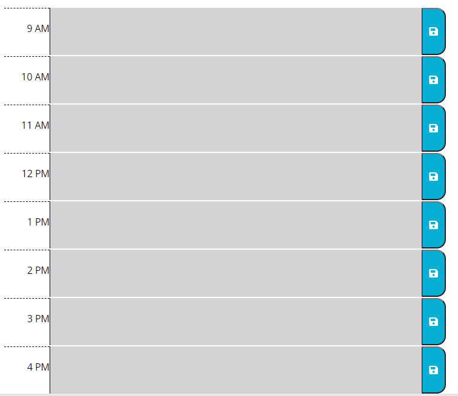
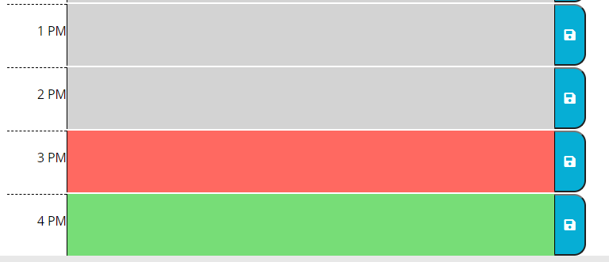
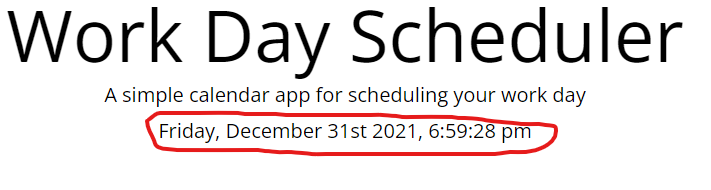
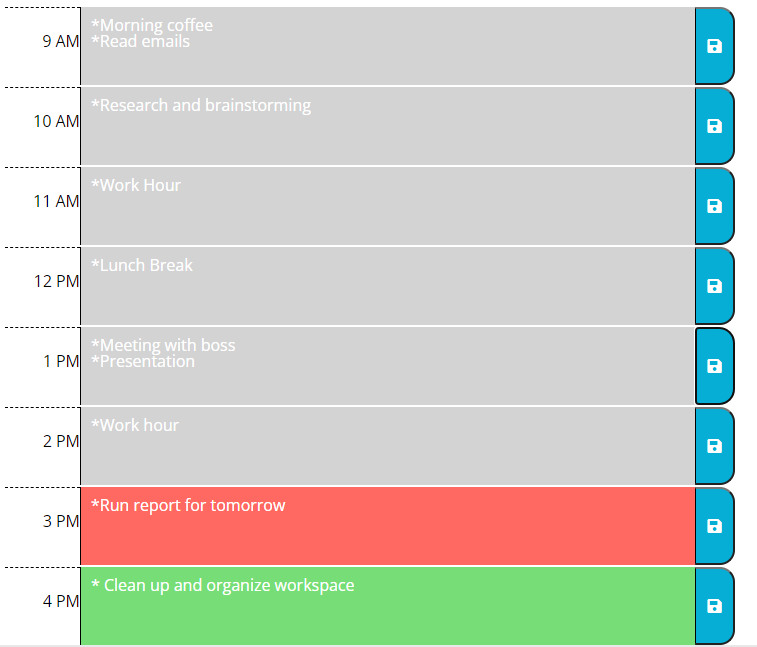

Hello Welcome to my "Work Day Schedule" application. 

In this application, user will be able to log their task for each time slot. The application will be able to detect and color code when time past or is current or in the future. Information that user input and save will be saved and will reload when application is open again or refreshed. 

This is how the application going to look like when first open.  But, depending on the time, color may differ. If the current time is before the start time of application, the color code for each slot will be green.  Whenever the slot is red, it is indicating the current slot is the current time. The current time should be display near the top of page and under the title. 

Whenever time past working hours, the slot will become grey.  Data stored in slot will not be deleted. As long as user saved data and information that user input. The data and information will remain in their spot even when the page is refresh. This is an example. 

To access the application from here. [Click-Me](https://luckylobster25.github.io/Schedule-Homework/)